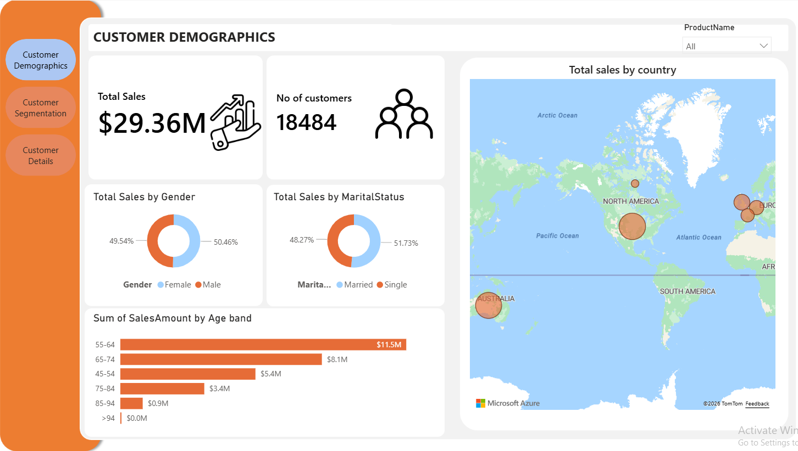
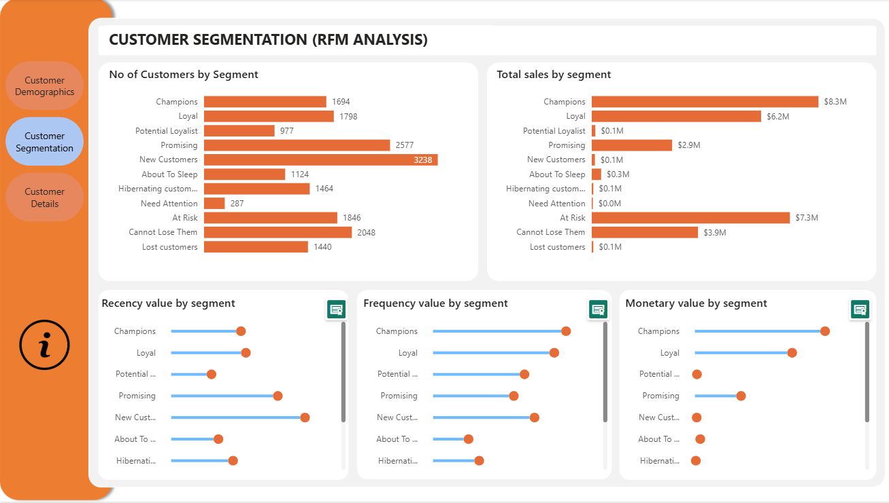
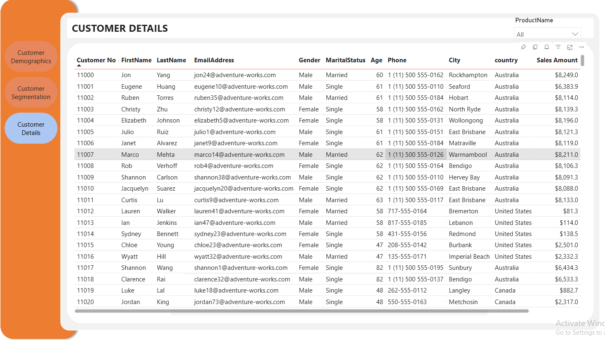
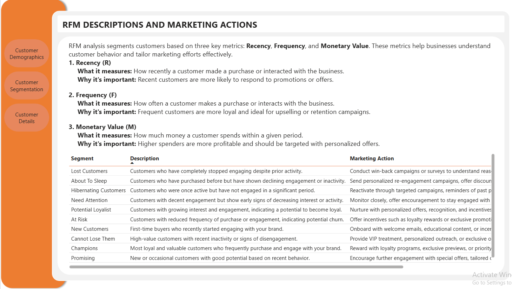

# Customer RFM Analysis Dashboard

## Overview
This project focuses on **Customer RFM (Recency, Frequency, Monetary) Analysis** using Power BI to identify customer behavior patterns, segment customers based on loyalty, and generate actionable business insights for marketing and retention strategies.

The dashboard was built using customer sales transaction data and follows a complete analytics workflow including:

- Data extraction and cleaning
- SQL-based preprocessing
- Power BI data modeling
- DAX calculations for RFM metrics
- Customer segmentation
- Interactive dashboard creation

---

# Dashboard Pages

## 1. Customer Demographics
This page provides an overview of customer demographics and purchasing behavior.

### Key Insights:
- Total Sales and Customer Count
- Sales distribution by Gender
- Sales distribution by Marital Status
- Sales contribution by Age Band
- Geographic sales distribution by Country

### Dashboard Preview

---

## 2. Customer Segmentation (RFM Analysis)
Customers are segmented into **11 loyalty categories** using RFM scoring logic.

### Segments Include:
- Champions
- Loyal Customers
- Potential Loyalists
- Promising
- New Customers
- About To Sleep
- Hibernating Customers
- Need Attention
- At Risk
- Cannot Lose Them
- Lost Customers

### Key Analysis:
- Number of customers by segment
- Total sales by segment
- Recency score analysis
- Frequency score analysis
- Monetary value analysis

### Dashboard Preview

---

## 3. Customer Details
This page contains drill-down level customer information.

### Included Details:
- Customer Number
- Name
- Email
- Gender
- Marital Status
- Age
- Phone Number
- City & Country
- Sales Amount

This page enables detailed customer-level analysis and filtering.

### Dashboard Preview

---

## 4. RFM Descriptions & Marketing Actions
This hidden page explains the RFM framework and provides recommended marketing strategies for each customer segment.

### Included Information:
- Definition of Recency, Frequency, and Monetary metrics
- Importance of each metric
- Segment-wise customer behavior descriptions
- Suggested marketing actions for retention and engagement

### Dashboard Preview

---

# Data Processing Workflow

## Data Source
Sample sales/customer transaction dataset.

## Data Cleaning
The dataset was cleaned and transformed using SQL and Power Query.

### Cleaning Steps:
- Handled null values
- Standardized column formats
- Data type corrections
- Removed inconsistencies

---

# Power BI Transformations

Created additional calculated columns including:
- Age Bands
- Customer Segments
- RFM Score Categories

---

# RFM Analysis Logic

Customers were scored based on:

## Recency (R)
How recently a customer made a purchase.

## Frequency (F)
How often a customer makes purchases.

## Monetary (M)
How much money a customer spends.

---

# DAX Measures Used

The dashboard uses several DAX calculations for RFM scoring and segmentation including:

- Last Transaction Date
- Monetary Value
- Frequency Value
- Recency Value
- Frequency Score
- Monetary Score
- Recency Score
- Combined RFM Score

Example DAX measures used in the project:
- `Last_Transaction_Date`
- `Monetary Value`
- `Frequency Value`
- `Recency Value`
- `RFM Score`

---

# Tools & Technologies

- Power BI
- SQL Server
- Power Query
- DAX
- Data Modeling

---

# Business Value

This dashboard helps businesses:
- Identify loyal and high-value customers
- Detect at-risk customers
- Improve retention strategies
- Personalize marketing campaigns
- Understand customer purchasing behavior
- Optimize customer engagement efforts

---

# Author

## Siddharth Chandurkar
Data Analyst | Analytics Engineer | Business Intelligence

- LinkedIn: https://www.linkedin.com/in/siddharth-chandurkar
- GitHub: https://github.com/siddharthchandurkar-git
