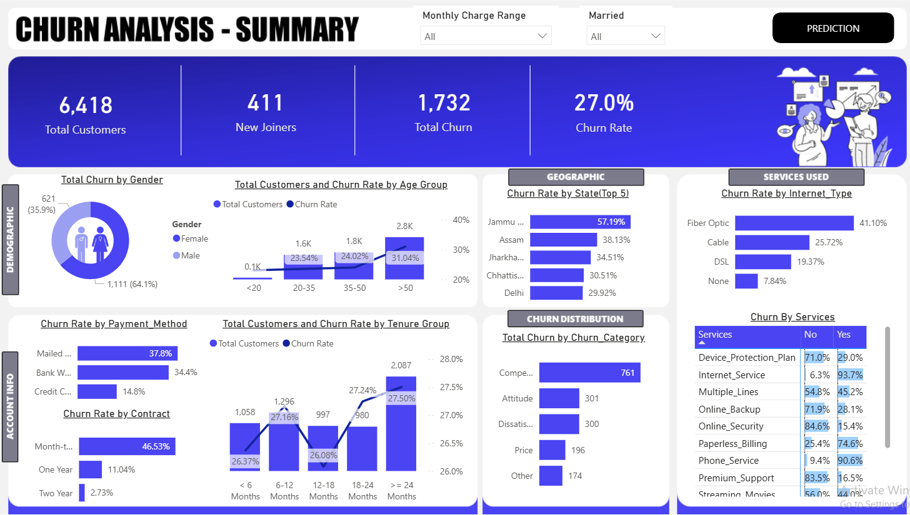
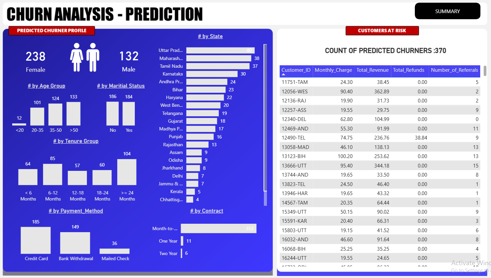

# 📊 Customer Churn Analysis & Prediction

An end-to-end data analytics and machine learning project focused on analyzing customer churn patterns and predicting future churners for a telecom company.

---

## 🚀 Project Overview

Customer churn is a critical business problem in the telecom industry. This project aims to:

- Analyze customer behavior and churn patterns  
- Identify key factors driving churn  
- Build a predictive model to identify customers at risk  
- Enable data-driven decision-making through dashboards  

The project integrates **SQL + Power BI + Python (ML)** to deliver both **descriptive and predictive insights**.

---

## 🛠️ Tech Stack

- **SQL (MS SQL Server)** – Data cleaning, transformation, EDA  
- **Power BI** – Interactive dashboards and visual analytics  
- **Python** – Machine Learning (Random Forest)  
- **Pandas, NumPy, Scikit-learn** – Data processing and modeling  

---

## 📂 Project Workflow

### 1. Data Preparation (SQL)

- Loaded raw telecom customer data into SQL  
- Performed **Exploratory Data Analysis (EDA)**  
- Identified and handled **null values**  
- Cleaned and transformed data in staging layer  
- Moved cleaned data to production tables (**ETL process**)  

---

### 2. Data Transformation (Power BI)

- Imported production data into Power BI  
- Performed additional transformations using Power Query  
- Created derived columns:
  - **Age Group**
  - **Billing Group (based on Monthly Charges)**  

---

### 3. Dashboard Development

#### 📊 Summary Dashboard

Provides a complete overview of customer behavior:

- Total Customers, New Joiners, Total Churn, Churn Rate  
- Churn distribution by:
  - Gender  
  - Age Group  
  - Payment Method  
  - Contract Type  
  - Tenure  
  - Geography  
  - Services used  

📸 Dashboard Preview:  

---

### 4. Churn Prediction (Machine Learning)

- Built a **Random Forest Classifier** using Python  
- Steps included:
  - Data preprocessing  
  - Feature encoding  
  - Train-test split  
  - Model training & evaluation  

- Generated predictions for **future churners**

---

### 5. Prediction Dashboard

- Integrated predicted churn data into Power BI  
- Built a dashboard to analyze:
  - Customer segments at risk  
  - Demographic patterns of predicted churners  
  - Key behavioral indicators  

📸 Dashboard Preview:  

---

## 📈 Key Insights

- Customers with **month-to-month contracts** show highest churn  
- Higher churn observed in **low tenure groups**  
- **Fiber optic users** exhibit higher churn compared to other services  
- Certain states show significantly higher churn rates  
- Payment methods and service usage patterns strongly influence churn  

---

## 🎯 Business Impact

- Helps identify **high-risk customers early**  
- Supports **targeted retention strategies**  
- Enables **data-driven decision-making**  
- Bridges gap between **analytics and business strategy**  

---

